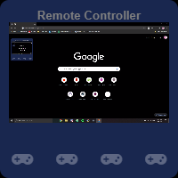
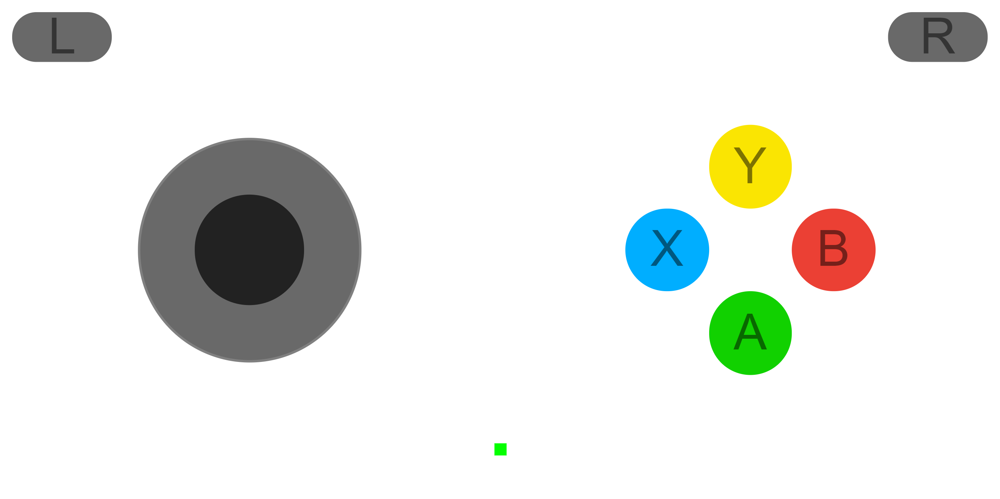

# The Original Problem
I had a game I wanted to play with some friends but because Australia has The Best™ internet and The Greatest™ broadband schemes some of my friends' internet connections couldn't handle the stream. This was quite an issue and actually made the game unplayable with the input lag. The other problem was that I didn't own an Xbox controller and neither did some of my friends, and while some games offer split keyboard, which Steam Remote Play supports it is limited to 2 players.

# The Solution
So me being me, I thought "I know programming, I can make random pointless projects, I'll make my own remote play system!" I wanted something that would be bare bones so internet traffic was a low as possible and the connection was as direct as possible. The basic premise was to have a client that would give the user a controller interface, and a server to run on my PC to emulate the actual devices. Given my addiction to JavaScript it was already decided this needed to be in Node. So I looked around on NPM for various modules and eventually found [vJoy](https://www.npmjs.com/package/vjoy). It allows you to emulate a "vJoyDevice" on your computer using JS. So with that I got going.

# The Server
Because all the actual emulation would happen on the server I decided to get started on that first. I wanted to use a web server so my friends didn't have to install anything. So I used [express](http://expressjs.com/) to run the server. Because this was going to be a real-time app I also needed some worm of real-time communication. For that I used the popular websocket library [Socket.IO](https://socket.io/).

## The First Attempt
To test this I just opened Windows' gamepad tester. I just had the server pretend a user was pressing he button and releasing it every second. This worked like a charm so I moved on to getting a simple client going.

# The Client
The client is just a webpage with a connection to the socket.io server. I added a touch based "joystick" and an A button. The joystick was fairly complex but just a bit of trigonometry to limit it to the proper movement. After adding this and ironing out the many issues that come with prototypes I moved to my first test with an actual game.

## The Problem of Controller Support
It was at this point I realized that the controller library I was using was not emulating an Xbox controller, so games would not recognize it. So the hunt began again for an Xbox emulator for node. After about 2 hours of looking I found [vgen-xbox](https://www.npmjs.com/package/vgen-xbox), a binding over the vGenInterface library in C.

# Redoing the Server
Now with a client to test and a working emulator library I began setting up the system for connecting controllers for each new client. This had the limitation that you can only have 4 emulated devices. So I added a limit to the clients and refused any that joined after 4.

With that I had my next prototype. I booted it up and I was ecstatic to find I needed to add new buttons. The game recognized the controller but I needed to have more buttons to do very much. So it was back to adding functionality to the client.

# Buttons, Buttons, Buttons
After a few playtests I got most of the buttons added and working. The layout on a phone screen was quite awkward but I eventually got a layout that worked.

# Sharing with Friends
Now that I had a working prototype I gathered some of my friends to play some games. We had fun for the first 5 minutes before the streaming quality on both Discord and Steam Remote Play took a dive and gathered close to 1 second of lag. I also had a fun time wondering why the system kept connecting and disconnecting "ghost" clients. The constant ba-dum that windows made when a controller was plugged in was beginning to get annoying. At first, I though it was my friends trying to annoy me, but I soon realized that phones will keep the page alive by activating it for a short time in the background, even while the phone is locked, which meant the server would detect a new client, get a small amount of data and then have it disconnect. This would happen every minute or so, or whenever woke up my phone. To avoid any issues I added a status panel to show how many controllers were connected.

# The Issue of Screen Sharing
The most common way to share screens is to use a transcoding server that takes the brunt force of bitrate handling. However, that means there is an increased latency. To remedy this I made the completely sane and rational decision to implement a peer-to-peer screen sharing system built into the controller system myself.

# WebRTC
Surprisingly, most web browsers support something like this with a technology known as WebRTC or Web Real-Time Communication. It supports streaming audio and video over a peer-to-peer connection, meaning I could share my screen directly to my friends using the same server I use for the controller to initialize the connection and then stream directly from my app to their computer.

After hours of reading on the APIs and wondering why my system wouldn't work I soon realized I had a small spelling mistake and eventually got it working. I had an issue though. It wouldn't connect no matter how hard I tried. The screen capture was fine but the stream clients would not even register as connecting to the server. I eventually realized that not only was the tutorial I was following outdated, I also was testing locally which meant a whole step I required to happen wouldn't get hit.

So I got back to begging friends to sit and reload a page and relay the error logs to me, and after about an hour of debugging and "reload.... yep reload" later I had a stream of my desktop going to my friend.

# Finishing Up
I now had a working remote play system built from scratch with quite a nice feel. An to be honest I might end up using it as a controller for myself.

It ended up looking like this:

For those that want an in depth explanation of the inner workings and how to build one yourself (I warn against this however as security has not been considered at all in this.) I have a GitHub repository [here]() for the project as well as a tutorial coming Soon™ in the next pages.

This was a fun project and I learnt a lot with it. I will however say that messing with drivers is now my least favorite thing to do as no matter how fast an SSD is, restarting your PC to test changes in your code is a pain.
